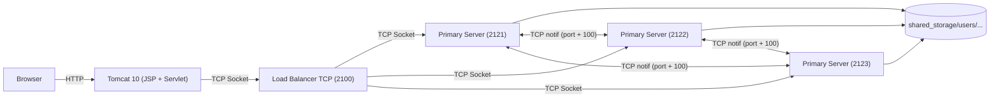

# SmartDrive — Explication technique complète (soutenance)

Ce document explique **le fonctionnement du code** (qui fait quoi, comment les données circulent, quel protocole est utilisé) pour pouvoir répondre précisément aux questions du prof.

> Contrainte clé du projet : **uniquement des sockets TCP Java** (`ServerSocket`/`Socket`).
> - Le navigateur **ne parle jamais directement** au serveur TCP.
> - La partie Web (JSP/Servlet) sert de **pont HTTP → TCP**.
> - **Aucun WebSocket** (pas d’API `javax.websocket` / `jakarta.websocket`, pas de handshake `Upgrade: websocket`).

---

## 1) Architecture globale (qui parle à qui)

### 1.1 Schéma

### 1.2 Responsabilités

- **Web (Tomcat / JSP / Servlet)** :
  - Gère les pages, formulaires, sessions HTTP, affichage.
  - Transforme des actions Web en **commandes TCP** envoyées au backend.
  - Exemple : login via formulaire → servlet ouvre un socket TCP → envoie `LOGIN;user;pass`.

- **Load balancer TCP** :
  - Reçoit une connexion TCP (client = servlets ou client CLI).
  - Choisit un serveur primaire (round-robin / sticky possible) et **relaye le flux TCP brut** (texte + binaire) dans les deux sens.
  - Peut refuser si tous les serveurs sont saturés (`max_clients_per_server`).

- **Serveur primaire TCP** :
  - Implémente toute la logique : authentification, quota, permissions, upload/download, versioning, corbeille, partage, notifications, audit, commandes admin.
  - Stocke sur le disque dans `shared_storage/`.

---

## 2) Ports & configuration

### 2.1 Ports par défaut (repo)

- Load balancer : `2100` (voir `backend/loadbalancer/resources/lb_config.json`)
- Primaires : `2121`, `2122`, `2123` (config LB)
- Web : `8080` (Tomcat)
- Notifications inter-primaires : **port du primaire + 100** (ex : 2121 → 2221)

### 2.2 Fichiers de configuration importants

- LB : `backend/loadbalancer/resources/lb_config.json` (local) et `lb_config.docker.json` (Docker)
  - `max_clients_per_server`: si `1`, alors **un seul client par serveur** → possible message *All servers busy...*
  - `round_robin`: répartition circulaire
  - `sticky_by_ip` (si activé dans config) : même IP client → même serveur tant que possible

- Serveur : `backend/server/resources/server_config.json`
  - `storage_root`: racine stockage (ex `shared_storage`)
  - config slave (réplication scriptée)

- Utilisateurs : `backend/server/resources/user.json`
- Quotas : `backend/server/resources/quotas.json`
- Permissions : `backend/server/resources/permissions.json`
- Audit : `backend/server/resources/audit.log` (chemin résolu via `StoragePaths`)

---

## 3) Protocole applicatif (TCP) : texte + binaire

### 3.1 Principes

- Les **commandes** sont des lignes texte (une commande = une ligne) séparées par `;` :
  - format : `CMD;arg1;arg2;...`
- Certaines commandes déclenchent un **mode binaire** (upload/download) :
  - le serveur envoie un en-tête texte (`READY` ou `FILE;<size>`) puis on transfère des **octets bruts**.
- Le Load Balancer ne comprend pas le protocole : il **transmet** simplement les octets.

### 3.2 Commande obligatoire au début : LOGIN

Backend : `backend/server/src/ClientThread.java`

1. Le serveur attend **en première ligne** :
   - `LOGIN;<username>;<password>`
2. Réponse :
   - `Welcome <username>;admin=<true|false>`
   - ou `ERROR ...`

#### Règle admin (exigence du projet)

Le serveur calcule `isAdmin` ainsi :

- admin seulement si : `record.admin == true` **ET** username == `Tsoa` (insensible à la casse)

Donc il n’y a qu’un **seul admin** fonctionnel : **Tsoa / 1234** (si présent dans `user.json`).

### 3.3 Upload (UPLOAD) — séquence exacte

Backend : `ClientThread.handleUpload`.

1. Client → serveur : `UPLOAD;<filename>;<size>`
2. Le serveur vérifie :
   - nom de fichier “safe” (`StoragePaths.isSafeFilename`)
   - permission d’écriture (`fileManager.canWrite(username)`)
   - quota suffisant (`fileManager.hasEnoughQuota(username, size)`)
   - si le fichier existe : **versioning** (`VersionManager.archiveIfExists`) avant écrasement
3. Serveur → client : `READY`
4. Client → serveur : envoi de `<size>` octets sur le même socket
5. Serveur : écrit sur disque (`FileOutputStream`), puis :
   - consomme le quota (`fileManager.consumeQuota`)
   - écrit l’audit (`AuditLogger.log`)
   - pousse des notifications (`NotificationService.broadcastNewFile`)
   - avertit si quota presque plein via `NotificationStore`
6. Serveur → client : `OK Upload successful` (ou `ERROR ...`)

### 3.4 Download (DOWNLOAD)

Backend : `ClientThread.handleDownload`.

1. Client → serveur : `DOWNLOAD;<filename>`
2. Serveur → client : `FILE;<size>`
3. Serveur → client : envoi binaire du fichier (exactement `<size>` octets)
4. Audit : `download` écrit dans `audit.log`

### 3.5 Liste de fichiers (LIST)

- Client → serveur : `LIST`
- Serveur → client :
  - première ligne = nombre `N`
  - puis `N` lignes (nom, taille, date, etc. selon implémentation)

### 3.6 Gestion corbeille

Backend : `TrashManager` + commandes dans `ClientThread`.

- Supprimer → corbeille : `DELETE;<filename>`
  - réponse : `OK TRASHED;<trashId>`
- Lister corbeille : `TRASH_LIST`
- Restaurer : `TRASH_RESTORE;<trashId>`
- Purger : `TRASH_PURGE;<trashId>`

Le stockage corbeille est sous un répertoire dédié dans l’espace utilisateur (voir `StoragePaths`/`TrashManager`).

### 3.7 Versioning

Backend : `VersionManager`.

- Listing versions : `VERSIONS;<filename>`
- Restaurer une version : `RESTORE_VERSION;<filename>;<versionId>`

Le principe : **avant d’écraser** un fichier lors d’un upload, l’ancienne version est archivée.

### 3.8 Partage (demande d’accès lecture)

Backend : `ShareRequestManager` + commandes dans `ClientThread`.

- Voir les fichiers d’un autre utilisateur + statut : `LIST_SHARED;<owner>`
- Demander lecture : `REQUEST_READ;<owner>;<file>`
  - crée une demande `pending` si applicable
  - notifie le owner via `NotificationStore.push(owner, ...)`
- Côté owner (recevoir demandes) : `LIST_REQUESTS`
- Côté owner (répondre) : `RESPOND_REQUEST;<requester>;<file>;<approve|deny>`
  - notifie le requester quand c’est `OK ...`
- Télécharger en tant que (si approuvé) : `DOWNLOAD_AS;<owner>;<file>`

---

## 4) Stockage disque (où sont les fichiers)

### 4.1 Layout

- Racine : `shared_storage/` (ou valeur configurée)
- Par utilisateur : `shared_storage/users/<username>/...`

Les managers (`StoragePaths`, `TrashManager`, `VersionManager`) centralisent les chemins et les règles “safe filename”.

### 4.2 Qui gère le stockage ?

- **Serveur TCP** (pas le Web) :
  - écrit les fichiers lors de `UPLOAD`
  - lit lors de `DOWNLOAD` / `DOWNLOAD_AS`
  - déplace en corbeille / restaure / purge
  - archive des versions

La partie Web ne fait que transporter les octets (via TCP) et afficher le résultat.

---

## 5) Quotas & permissions

### 5.1 Quotas

Backend : `backend/server/src/FileManager.java`.

- Les quotas sont stockés en JSON (`quotas.json`).
- Lors d’un upload :
  - le serveur vérifie `hasEnoughQuota` avant d’accepter le binaire
  - après succès : il appelle `consumeQuota(username, size)`

### 5.2 Permissions

- `permissions.json` détermine si un user peut écrire.
- Le serveur bloque l’upload si `canWrite(username)` est false.

---

## 6) Audit logs (traçabilité)

Backend : `backend/server/src/AuditLogger.java`.

- Chaque action importante (upload, download, delete, share, admin) écrit une ligne **UTF‑8** dans `audit.log`.
- Format :
  - `timestamp;actor;action;details`

Commande admin : `ADMIN_LOGS;<limit>` renvoie les dernières lignes.

---

## 7) Notifications

Il y a deux niveaux :

1) **Notifications “locales” par utilisateur** (`NotificationStore`) :
- Exemple : demande de partage reçue, quota presque plein.
- Commandes :
  - `NOTIFS` → liste
  - `NOTIFS_CLEAR` → vider

2) **Notifications inter-primaires** (`NotificationService`) :
- Quand un fichier est uploadé, on broadcast l’évènement aux autres primaires via TCP sur `primaryPort + 100`.
- Objectif : cohérence / propagation d’événements (selon le scénario du projet).

---

## 8) Admin : commandes et panneau web

### 8.1 Commandes admin côté TCP

Backend : `ClientThread`.

- `ADMIN_USERS` : liste des users + admin/blocked/quota
- `ADMIN_BLOCK;<user>;<true|false>`
- `ADMIN_DELETE;<user>` (supprime aussi les données disque + quota)
- `ADMIN_SET_QUOTA;<user>;<bytes>`
- `ADMIN_STORAGE` : stats globales (bytes, files) + statut slave
- `ADMIN_LOGS;<limit>` : renvoie dernières lignes audit
- `ADMIN_MONITOR` : CPU/RAM/disk/traffic
- `ADMIN_LIST_FILES;<user>` : lister fichiers d’un user (admin)
- `ADMIN_DOWNLOAD_AS;<owner>;<file>` : télécharger un fichier d’un user (admin)

Toutes ces commandes passent par `ensureAdmin`.

### 8.2 Panneau admin web (HTTP → TCP)

- Le navigateur appelle des routes `/admin/...`.
- Les servlets ouvrent une socket TCP vers le backend (souvent via le LB), envoient les `ADMIN_*`, puis rendent une JSP.

Les pages admin ont une pagination (10 lignes/page) côté servlet.

---

## 9) Partie Web : pourquoi elle n’est PAS du WebSocket

- Le navigateur parle en HTTP (JSP/Servlet sur Tomcat).
- La servlet, côté serveur web, ouvre **une socket TCP Java classique** vers le LB/backend.
- Il n’y a pas de `Upgrade: websocket`, ni de session WS.

Fichiers clés :
- Pont TCP côté web : `backend/client/src/model/Serveur.java` (ouvre `Socket`, `BufferedReader`, `PrintWriter`)
- Contrôleurs servlet : `backend/client/src/controller/*.java`
- Appels protocole : `backend/client/src/Service/ServeurService.java`

---

## 10) Démarrage Docker (pour la soutenance / PCs différents)

Scripts racine :

- `./docker-up.sh` : build + run (serveurs + LB + Tomcat) sur un réseau docker `smartdrive_net`
- `./docker-down.sh` : arrêt + nettoyage

Points importants :
- Les serveurs primaires montent des volumes `resources/` et `shared_storage/`.
- Le web (Tomcat) reçoit `SMARTDRIVE_BACKEND_HOST=loadbalancer` et `SMARTDRIVE_BACKEND_PORT=2100`.

---

## 11) FAQ (questions typiques du prof)

### Q1 — « Pourquoi TCP sockets et pas WebSocket ? »
- Exigence du cahier des charges : implémentation bas niveau en TCP (`ServerSocket/Socket`).
- WebSocket est un protocole au-dessus de HTTP (upgrade handshake), ce qui n’est pas utilisé ici.

### Q2 — « Comment vous séparez texte et binaire ? »
- Commandes = `readLine()` (mode texte).
- Pour upload/download : on envoie d’abord une ligne d’en-tête (`READY` / `FILE;<size>`), puis on lit/écrit exactement `<size>` octets via `InputStream`/`OutputStream`.

### Q3 — « Le Load Balancer comprend le protocole ? »
- Non : il relaye le flux TCP brut dans les deux sens (`forwardData`).
- Donc il supporte automatiquement le texte + binaire.

### Q4 — « Pourquoi parfois “All servers busy” ? »
- Parce que `max_clients_per_server` peut être à `1` dans `lb_config.json`.
- Si chaque primaire a déjà un client, LB ne peut plus allouer.

### Q5 — « Qui applique le quota ? »
- Le **serveur TCP** uniquement.
- Il refuse l’upload avant le transfert binaire si quota insuffisant, puis consomme après succès.

### Q6 — « Comment garantissez-vous un seul admin ? »
- Même si `user.json` contient `admin=true` pour plusieurs users, le code exige en plus le nom `Tsoa`.

---

## 12) Références directes dans le code

- Serveur TCP (loop + protocole) : `backend/server/src/ClientThread.java`
- Quotas/permissions : `backend/server/src/FileManager.java`
- Utilisateurs JSON : `backend/server/src/UserStore.java`
- Load balancer : `backend/loadbalancer/src/LoadBalancer.java`
- Storage paths : `backend/server/src/StoragePaths.java`
- Corbeille : `backend/server/src/TrashManager.java`
- Versions : `backend/server/src/VersionManager.java`
- Partage : `backend/server/src/ShareRequestManager.java`
- Audit : `backend/server/src/AuditLogger.java`
- Bridge TCP côté web : `backend/client/src/model/Serveur.java`
- Service protocole côté web : `backend/client/src/Service/ServeurService.java`
